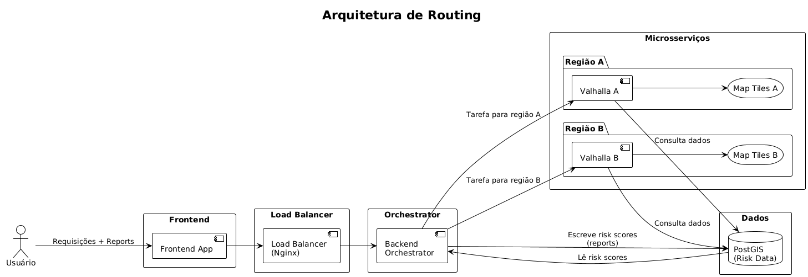
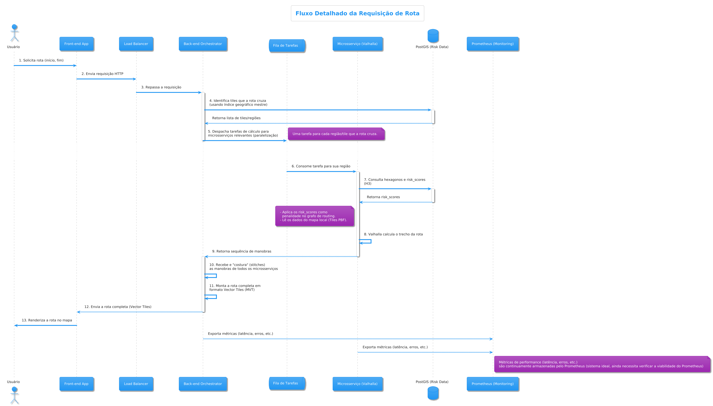

# Arquitetura do Sistema

## Diagrama de Arquitetura

Este diagrama ilustra os componentes principais e suas interações de alto nível.

* **Frontend App:** Interface do usuário para submissão de reports e visualização de rotas.
* **Load Balancer (Nginx):** Distribui as requisições para garantir que o sistema não sobrecarregue.
* **Orchestrator:** O "cérebro" do backend, responsável por gerenciar o fluxo de requisições.
* **Microsserviços:** Serviços especializados. O principal é o de Roteamento (com instâncias do Valhalla), que pode ser escalado por região.
* **Dados (PostGIS):** Nosso banco de dados central, otimizado para consultas geoespaciais.

## Fluxo Detalhado de Requisição de Rota (Diagrama de Sequência)

O diagrama a seguir detalha a sequência exata de eventos para uma única requisição de rota segura.

