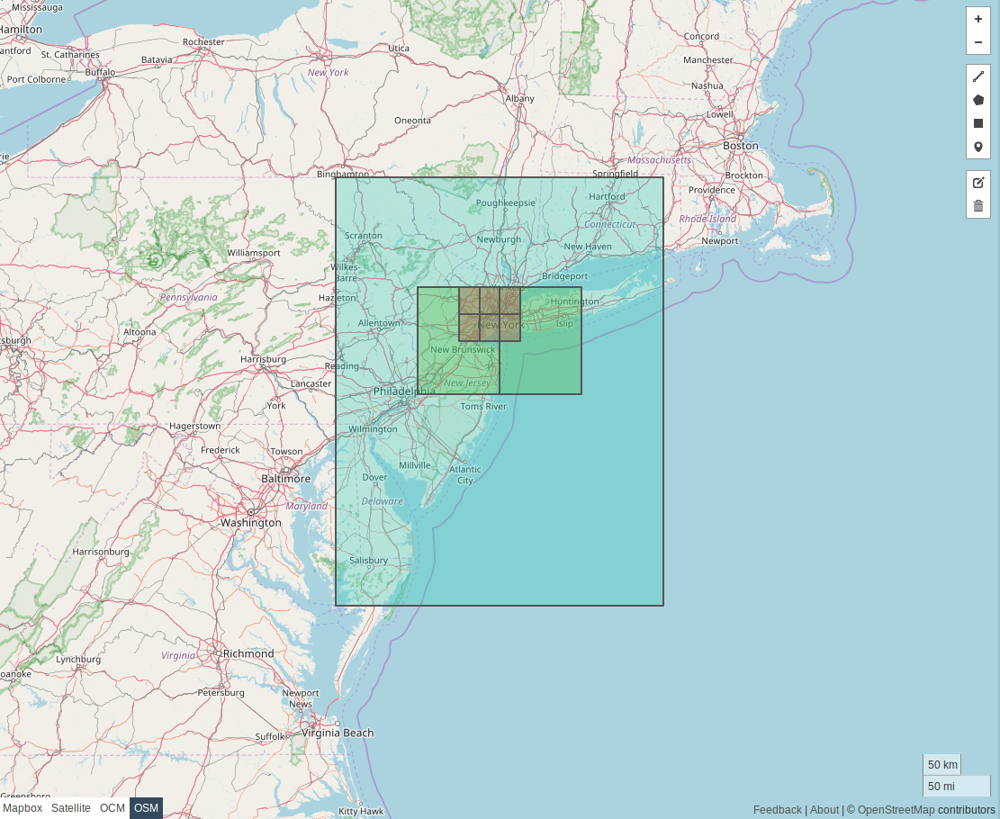

# Arquitetura do Sistema

## Visão Geral da Arquitetadura

A arquitetura do sistema foi projetada para separar claramente os processos assíncronos de construção de dados dos processos síncronos de consulta em tempo real. 

* **Plataforma Online:** Engloba todos os serviços que interagem diretamente com o usuário em tempo real, como o Frontend, o Backend Orchestrator (ou Load Balancer com NGNIX) e o Cluster de Roteamento Valhalla.
* **Pipeline de Dados e Map Builder (Offline):** Um conjunto de processos automatizados que rodam em segundo plano. Ele consome dados de fontes externas (OpenStreetMap) e internas (PostGIS com `risk_scores`) para gerar os artefatos de mapa enriquecidos que a plataforma online utiliza.
* **Object Storage (S3, GCS):** Atua como a ponte entre os dois ambientes, armazenando os artefatos de mapa versionados para deploy.

## Fluxos de Operação

A operação do sistema é dividida em dois fluxos principais e distintos: a alimentação periódica dos dados de risco e a requisição de rotas em tempo real pelo usuário.

### Fluxo de Build Periódico (Offline Assíncrono)

Este diagrama detalha o processo automatizado que roda periodicamente (ex: diariamente as 04:00 da manhã ou qualquer horário definido pela equipe) para recriar os mapas do Valhalla, incorporando os `risk_scores` mais recentes.

### Fluxos de Usuário (Online Síncrono)

Este diagrama mostra a sequência de interações para os dois casos de uso principais do usuário: submeter um novo report (que irá alimentar o próximo ciclo de build) e solicitar uma rota segura.

## Valhalla

O motor de roteamento open-source Valhalla é o núcleo do serviço de rotas. Seus componentes e o funcionamento dos dados são detalhados a seguir.

### Tiles e Hierarquia de Dados 
> TRADUZIDO DE https://valhalla.github.io/valhalla/tiles/

Um **tile** (ou bloco) representa uma pequena seção retangular de uma área geográfica. O mapa inteiro é dividido em uma grade de *tiles* quadrados, que são arquivos em um formato binário específico contendo todas as informações necessárias para o roteamento.

Os tiles são organizados em uma hierarquia de três níveis para otimizar buscas de longa distância:

| Nível de Hierarquia | Tamanho do Tile | Conteúdo Principal |
| :--- | :--- | :--- |
| 0 | 4° | Vias expressas (ex: `motorway`, `trunk`) |
| 1 | 1° | Vias arteriais (ex: `primary`, `secondary`) |
| 2 | 0.25° | Vias locais (ex: `residential`, `service`) |

Em cada nível, o mundo é dividido usando a caixa delimitadora `(-180, -90, 180, 90)`, com a ordenação começando do canto inferior esquerdo.

#### Visualização 

A imagem a seguir mostra a divisão do mundo nos tiles de nível 0.

Abaixo, exemplos de como regiões específicas são cobertas pelos diferentes níveis de tiles (Nível 0: azul, Nível 1: verde, Nível 2: vermelho).

**Alemanha**

**Pensilvânia**

**Nova Iorque**

### Componentes Internos do Valhalla

O Valhalla é composto por vários módulos, cada um com uma responsabilidade clara no processo de build e de roteamento.

#### Mjolnir

**Responsabilidade:** Converter dados brutos do formato `.osm.pbf` para os tiles roteáveis do Valhalla. Mjolnir é o "compilador" do mapa que faz o `Extraction, Transformation and Loading (ETL)`.

**Localização:** `src/mjolnir/`

O processo, orquestrado pela ferramenta `valhalla_build_tiles`, segue várias etapas:

1.  **Parsing PBF (`pbfgraphparser.cc`):** Leitura do arquivo `.pbf` do OpenStreetMap, iterando sobre nós, vias e relações.
2.  **Construção do Grafo (`graphbuilder.cc`):** Transformação das entidades OSM em um grafo.
    * **Nós (Nodes):** Tornam-se vértices.
    * **Vias (Ways):** Tornam-se arestas (edges). A lógica de custo (velocidade, acesso) é aplicada aqui, configurada via scripts Lua (`/lua/graph.lua`). **É aqui que o `risk_score` é incorporado como um peso de custo**
3.  **Construção da Hierarquia (`hierarchybuilder.cc`):** Classificação das arestas nos níveis 0, 1 e 2 e geração de "atalhos" (shortcuts) para acelerar a busca.
4.  **Particionamento em Tiles (`graphtilebuilder.cc`):** Divisão do grafo global na grade de tiles (`.gph`).
5.  **Artefato Final:** O resultado é um diretório `valhalla_tiles` (ou `valhalla_tiles.tar`), que é o "binário" de produção.

#### Baldr: A Camada de Acesso a Dados

**Responsabilidade:** Definir e fornecer acesso eficiente às estruturas de dados do grafo.

**Localização:** `src/baldr/`

* **Estrutura do Tile (`graphtile.h`):** Cada arquivo `.gph` é um bloco binário com um layout denso para acesso rápido aos dados.
* **`GraphId` (`graphid.h`):** Um `uint64_t` que identifica unicamente qualquer nó no grafo global, codificando o ID do tile, o nível da hierarquia e o índice do nó.
* **Acesso e Memória (`graphreader.cc`):** Utiliza `mmap` para mapear o arquivo `valhalla_tiles.tar` no espaço de endereço virtual do processo. O sistema operacional gerencia o carregamento de dados do disco para a RAM sob demanda.

#### Tyr, Loki, Thor e Odin

1.  **Tyr (`src/tyr/`):** Recebe a requisição HTTP e orquestra o fluxo interno.
2.  **Loki (`src/loki/`):** O serviço de "matching". Converte as coordenadas da requisição (lat, lon) para os nós/arestas correspondentes no grafo ("snap-to-road").
3.  **Thor (`src/thor/`):** A engine de busca de caminho. Recebe os nós de Loki e executa os algoritmos de roteamento.
    * **Algoritmo (`bidirectional_astar.cc`):** Utiliza o A* Bidirecional para performance.
    * **Busca Hierárquica:** A técnica de otimização que "sobe" para as vias principais para trechos longos e "desce" para as vias locais nas pontas da rota.
4.  **Odin (`src/odin/`):** O serviço de "narrativa". Converte o caminho bruto (sequência de `GraphId`s) retornado pelo Thor em instruções de navegação turn-by-turn.

## Estratégia de Escalonamento

### Matriz de Decisão para Arquiteturas
> Pesquisa feita com `Deep Search` do Gemni 2.5 pro e `Investigar` do ChatGPT 4.0/5.0

| Critério | Replicação Monolítica | Sharding Geográfico | Lazy-Loading / Cache Remoto |
| :--- | :--- | :--- | :--- |
| **Tempo de Inicialização** | **Médio-Alto (1-10 min)** Depende do I/O do disco para o `mmap` inicial. | **Baixo (<2 min)** Dataset menor significa inicialização mais rápida. | **Muito Baixo (<10 seg)** O custo é transferido para a latência da primeira requisição. |
| **Velocidade de Escalonamento** | **Média** Limitada pelo tempo de inicialização. Requer over-provisioning. | **Rápida** Pods mais leves permitem que o HPA responda mais agilmente. | **Muito Rápida** Escalonamento do compute é desacoplado do dado. |
| **Eficiência de CPU/Memória** | **Alta (se bem dimensionado)** O `mmap` é extremamente otimizado. O "desperdício" é o custo de disco replicado. | **Muito Alta** Recursos alocados para a demanda específica de uma região. | **Variável** Degradada por I/O de rede; pode criar gargalos no cache remoto. |
| **Complexidade Operacional** | **Baixa** Deploy padrão. Artefato único. Load balancing stateless. | **Alta** Requer um proxy de roteamento L7 e múltiplos artefatos. | **Muito Alta** Requer driver customizado e infra de cache robusta. |
| **Isolamento de Falhas** | **Médio** Falha no pod afeta apenas aquele pod. | **Alto** Falha é contida no shard daquela região geográfica. | **Baixo** Dependência de um serviço de cache/storage centralizado. |
| **Roteamento Inter-regional**| **Nativo e Atômico** Performance ótima dentro de um único processo. | **Complexo e Lento** Requer costura de resultados entre shards, adicionando latência. | **Nativo (em teoria)** Degradado por múltiplas buscas de tiles remotos. |
| **Custo em Escala** | **Médio-Alto** Custo principal é o armazenamento em bloco (SSD) replicado. | **Médio** Economiza em armazenamento, mas adiciona custo do proxy e de engenharia. | **Potencialmente Baixo (em teoria)** Custo de engenharia e da infra de cache pode anular a economia. |

### Monolito Replicado com Orquestração

Para cobrir o Brasil e escalar para uma alta carga de requisições, a arquitetura de **Replicação Monolítica** é a escolha ideal. A complexidade introduzida pelas outras abordagens não justifica seus benefícios, exceto em escala verdadeiramente global.

**Justificativa Técnica:**

1.  **Evita Falácias de Sistemas Distribuídos:** Sharding e Lazy-Loading transformam um problema de computação local em um problema de sistema distribuído, introduzindo latência de rede e complexidade de consistência desnecessariamente.
2.  **Performance Atômica:** O `mmap` de um arquivo local é uma das operações de I/O mais rápidas possíveis. A transição entre tiles tem latência na ordem de microssegundos a milissegundos, enquanto uma chamada de rede adiciona dezenas a centenas de milissegundos.
3.  **Simplicidade Operacional:** A simplicidade de gerenciar um único artefato de mapa (enriquecido com `risk_score`) e um único tipo de serviço com um load balancer stateless é um benefício imenso em termos de confiabilidade, depuração e velocidade de desenvolvimento.