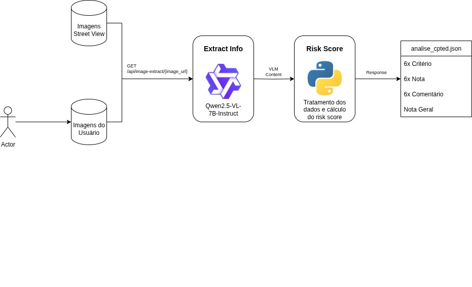

# Pipeline de Extração de Risk Score

[Figura 1 - Diagrama de Fluxo de Dados](assets/Fluxo_report.drawio)

## 1. Extração de Features com VLMs

Em vez de usar uma CNN tradicional, adotamos uma abordagem baseada em Modelos de Linguagem e Visão (VLMs) para uma extração de features mais rica.

### Etapa 1.1: Image-to-Text (Qwen)

**Entrada:** imagem de uma rua (fornecida pelo usuário ou obtida via Street View).

**Processo:** a imagem é convertida em um relatório detalhado de CPTED, no qual o modelo gera:

Notas de 0 a 10 para cada um dos seis critérios de avaliação.

Comentários explicativos que justificam as notas atribuídas.

### Etapa 1.2: Risk Score

Com base nas notas fornecidas na etapa anterior, o sistema calcula um Risk Score agregado, sintetizando o nível de risco da área analisada.

O cálculo considera o peso de cada critério de CPTED, resultando em uma métrica única e comparável entre diferentes locais.

## 2. Solução de Cold Start

Para superar o problema de falta inicial de dados de usuários, adotamos a seguinte estratégia:

Utilização da API do Google Street View para coletar imagens em massa.

Isso permite treinar e validar o pipeline antes da entrada de dados reais de usuários.

Assim, o modelo já está funcional e útil desde o primeiro dia de uso.