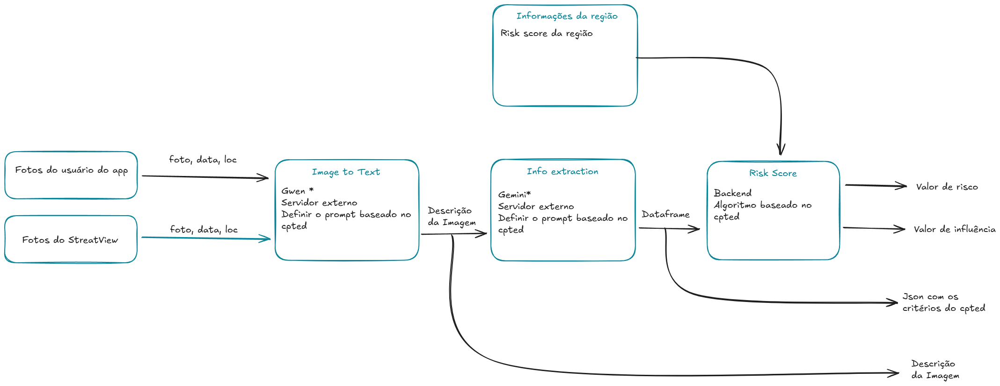

# Pipeline de Análise e Predição com IA

[Download Excalidraw file](assets/PIPELINE.excalidraw)

## 1. Extração de Features com VLMs

Em vez de usar uma CNN tradicional, adotamos uma abordagem baseada em Modelos de Linguagem e Visão (VLMs) para uma extração de features mais rica.

### Etapa 1.1: Image-to-Text (Qwen)

Uma imagem da rua (do usuário ou Street View) é convertida em uma descrição textual detalhada. Isso captura o contexto e a relação entre os objetos na cena.

### Etapa 1.2: Extração Estruturada (Gemini)

A descrição textual alimenta um LLM (Gemini) que, guiado por um prompt baseado nos princípios de **CPTED** (Crime Prevention Through Environmental Design), extrai e estrutura os fatores de risco em um formato JSON.

## 2. Análise Contextual com GNNs

O `risk_score` local de cada ponto é útil, mas a GNN nos permite entender como o risco se propaga.

### Arquitetura do Modelo (D-MPNN)

Utilizamos uma **Directed Message-Passing Neural Network (D-MPNN)**, uma arquitetura de ponta que opera sobre as **arestas direcionadas (vínculos)** do grafo. Diferente de outras GNNs, essa abordagem previne que mensagens voltem pelo mesmo caminho, reduzindo ruído e melhorando a qualidade da representação final do grafo.

## 3. Solução de Cold Start

Para o treinamento inicial, antes de termos dados de usuários, usamos a API do Street View para coletar imagens em massa, garantindo que o modelo seja funcional desde o primeiro dia.