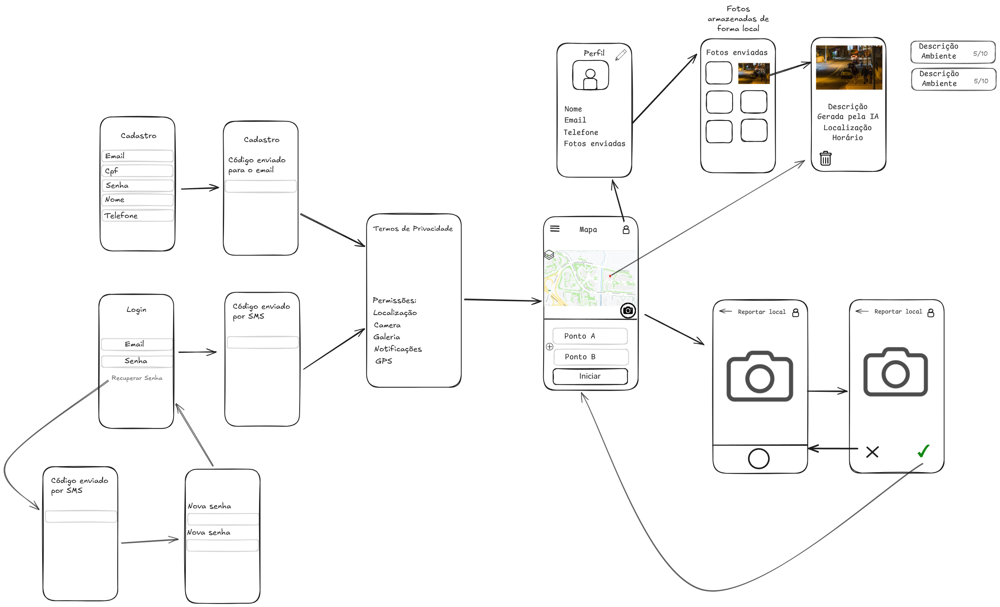

# Especificação de Requisitos de Software (ERS) - App GUIA

[Download Excalidraw file](assets/MVP.excalidraw)

## Requisitos Funcionais

| ID | Descrição |
| :--- | :--- |
| **RF 1** | **O usuário deve ser capaz de se cadastrar na plataforma.**  <ul><li>**RF 1.1:** O usuário deve informar o e-mail.</li><li>**RF 1.2:** O usuário deve informar a senha.</li><li>**RF 1.3:** O usuário deve informar o nome completo.</li><li>**RF 1.4:** O usuário deve ser capaz de fazer o cadastro pelo Google.</li></ul> |
| **RF 2** | **O usuário deve ser capaz de fazer login na plataforma.**  <ul><li>**RF 2.1:** O usuário deve ser capaz de fazer login pelo Google.</li><li>**RF 2.2:** O usuário deve ser capaz de fazer login apenas com e-mail e senha.</li><li>**RF 2.3:** O usuário deve ser capaz de recuperar a senha.</li><li>**RF 2.4:** O usuário deve ser capaz de alterar a senha.</li></ul> |
| **RF 3** | **O usuário deve ter um perfil.**  <ul><li>**RF 3.1:** O usuário deve ser capaz de editar as informações do perfil.</li><li>**RF 3.2:** O usuário deve ser capaz de visualizar as fotos já enviadas.</li><li>**RF 3.3:** O usuário deve ser capaz de apagar as fotos enviadas.</li><li>**RF 3.4:** O usuário deve ser capaz de visualizar o local da foto tirada.</li><li>**RF 3.5:** O usuário deve ser capaz de visualizar as informações de risco da foto tirada.</li><li>**RF 3.6:** O usuário deve ser capaz de visualizar os critérios do CPTED de forma clara.</li></ul> |
| **RF 4** | **O usuário deve ser capaz de escolher pontos no mapa.**  <ul><li>**RF 4.1:** O usuário pode escolher uma ou mais paradas entre o ponto inicial e final.</li><li>**RF 4.2:** O usuário deve ser capaz de visualizar a rota.</li><li>**RF 4.3:** O usuário deve ser capaz de visualizar os hexágonos.</li><li>**RF 4.4:** O usuário deve ser capaz de visualizar a pontuação de risco dos hexágonos próximos.</li></ul> |
| **RF 5** | **O sistema deve ser capaz de gerar a rota.**  <ul><li>**RF 5.1:** O sistema deve ser capaz de calcular rotas entre no máximo 4 pontos.</li></ul> |

## Requisitos Não Funcionais

| ID | Descrição |
| :--- | :--- |
| **RNF 1** | As fotos devem ficar armazenadas no dispositivo do usuário. |
| **RNF 2** | O e-mail do usuário precisa ser validado. |
| **RNF 3** | A rota deve ser calculada em até *x* segundos. |
| **RNF 3.1** | O sistema deve ser capaz de carregar informações das regiões próximas do usuário em no máximo *x* segundos. |

## Itens a Definir

A lista abaixo contém pontos que necessitam de detalhamento e decisão junto à equipe antes ou durante o desenvolvimento:

* Verificar viabilidade de autenticação de dois fatores por SMS ou e-mail.  
