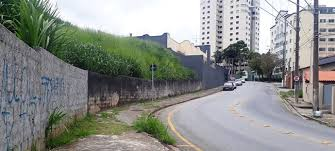

# Relatório de Comparação Entre os VLMS

Os modelos foram utilizados por meio da interface da Hyperbolic. Todos os modelos foram utilizados com a limitação de 512 tokens.

| Modelo                  | Preço             |
|-------------------------|-------------------|
| Qwen2-5-VL-72B-Instruct | $0.60 / 1M Tokens |
| Qwen2-5-VL-7B-Instruct  | $0.20 / 1M Tokens |
| Pixtral-12B             | $0.10 / 1M Tokens |

A imagem usada para a análise foi essa:




## Prompt 1
```
Quero que você atue como um especialista em CPTED (Crime Prevention Through Environmental Design).
Vou enviar uma imagem de uma rua e você deve analisar a cena segundo os seis princípios do CPTED:

Vigilância natural (V) → Há iluminação adequada? A rua é visível? Janelas e fachadas contribuem para a observação?  
Controle natural de acesso (A) → Existem barreiras, entradas definidas, portões ou elementos que limitem acessos indesejados?  
Reforço territorial (T) → Há sinais claros de propriedade e pertencimento (jardins cuidados, muros, sinalização, pintura)?  
Manutenção (M) → O espaço está limpo, conservado, sem pichações ou sinais de abandono?  
Atividades legítimas (AL) → O espaço é usado para atividades positivas (comércio, lazer, convivência)?  
Suporte para atividades sociais (S) → Existem estruturas que favorecem interação comunitária (praças, bancos, quadras)?  
Sua resposta deve conter:  
Uma avaliação descritiva de cada item.  
Uma nota de 0 a 10 para cada variável (V, A, T, M, AL, S).  
O cálculo do Risk Score da rua, aplicando a fórmula correspondente ao tipo de bairro (Residencial, Comercial ou Periférico).  
Uma sugestão de melhorias práticas para reduzir o risco segundo o CPTED.  
Se não for possível identificar alguma variável pela imagem, indique isso explicitamente.
```

## Pixtral-12B

```
Para analisar a imagem da rua segundo os seis princípios do CPTED, vamos avaliar cada um dos princípios:

1. Vigilância Natural (V)
Avaliação Descritiva: A rua parece bem iluminada e é visível. Existem edifícios ao longo da rua que contribuem para a observação.
Nota: 8/10
2. Controle Natural de Acesso (A)
Avaliação Descritiva: Não há barreiras visíveis ou portões que limitem acessos indesejados. As entradas parecem abertas.
Nota: 5/10
3. Reforço Territorial (T)
Avaliação Descritiva: Existem sinais de propriedade e pertencimento, como muros e jardins cuidados.
Nota: 7/10
4. Manutenção (M)
Avaliação Descritiva: A rua parece limpa e bem conservada, sem sinais de abandono ou pichações.
Nota: 8/10
5. Atividades Legítimas (AL)
Avaliação Descritiva: Não é possível identificar claramente se há atividades legítimas em andamento, como comércio ou lazer.
Nota: 5/10
6. Suporte para Atividades Sociais (S)
Avaliação Descritiva: Não há estruturas visíveis que favoreçam a interação comunitária, como praças ou bancos.
Nota: 4/10
Cálculo do Risk Score
Para calcular o Risk Score, vamos considerar que a imagem representa um bairro comercial. A fórmula para um bairro comercial é:

[ \text{Risk Score} = (V + A + T + M + AL + S) / 6 ]

Substituindo os valores:

[ \text{Risk Score} = (8 + 5 + 7 + 8 + 5 + 4) / 6 = 41 / 6 \approx 6.83 ]

Sugestões de Melhorias Práticas
Vigilância Natural: Instalar câmeras de segurança e garantir que as luzes públicas funcionem corretamente.
Controle Natural de Acesso: Implementar barreiras físicas ou portões controlados
```

## Qwen2-5-VL-7B-Instruct

```
Para a análise da imagem fornecida, vamos avaliar a rua segundo os seis princípios do CPTED:

Vigilância Natural (V):

Iluminação adequada: A rua parece ter iluminação natural devido à presença de árvores e plantas, mas não há evidências de iluminação artificial. A visibilidade pode ser limitada à noite.
Rua visível: A rua é visível, mas a visibilidade pode ser limitada devido à vegetação alta.
Janelas e fachadas contribuem para a observação: Não há janelas ou fachadas visíveis que contribuam para a observação da rua.
Nota: 5/10
Controle Natural de Acesso (A):

Barreiras, entradas definidas, portões ou elementos que limitem acessos indesejados: Não há evidências de barreiras, entradas definidas, portões ou elementos que limitem acessos indesejados.
Nota: 0/10
Reforço Territorial (T):

Sinais claros de propriedade e pertencimento: Há um muro que pode indicar propriedade, mas a vegetação alta dificulta a visualização.
Jardins cuidados, muros, sinalização, pintura: O muro parece ser uma barreira, mas a vegetação alta dificulta a visualização.
Nota: 3/10
Manutenção (M):

Espaço limpo, conservado, sem pichações ou sinais de abandono: A rua parece limpa, mas a vegetação alta e o muro podem indicar um estado de abandono.
Nota: 7/10
Atividades Legítimas (AL):

Espaço usado para atividades positivas: Não há evidências de atividades legítimas como comércio, lazer ou convivência.
Nota: 0/10
Suporte para Atividades Sociais (S):

**Estruturas que favorecem interação comunitária
```

## Qwen2-5-VL-72B-Instruct

```
Análise da Imagem Segundo os Princípios do CPTED
1. Vigilância Natural (V)
Avaliação Descritiva: A iluminação não é visível na imagem, mas a rua parece ser visível durante o dia. Não há janelas ou fachadas que contribuam para a observação da rua. A vegetação alta ao lado da rua pode obstruir a visão.

Nota: 3/10

2. Controle Natural de Acesso (A)
Avaliação Descritiva: Não há barreiras, entradas definidas, portões ou elementos que limitem acessos indesejados. A rua parece ser aberta e livre para qualquer tipo de acesso.

Nota: 2/10

3. Reforço Territorial (T)
Avaliação Descritiva: Não há sinais claros de propriedade e pertencimento. A vegetação alta e o muro com pichações não contribuem para a sensação de pertencimento.

Nota: 1/10

4. Manutenção (M)
Avaliação Descritiva: O espaço não está limpo e conservado. Há pichações no muro e a vegetação está alta e descontrolada.

Nota: 2/10

5. Atividades Legítimas (AL)
Avaliação Descritiva: Não é possível identificar atividades legítimas na imagem. A rua parece ser usada apenas para trânsito de veículos.

Nota: 3/10

6. Suporte para Atividades Sociais (S)
Avaliação Descritiva: Não há estruturas que favoreçam interação comunitária. A rua não parece ser um espaço para convivência social.

Nota: 1/10

Cálculo do Risk Score
Para calcular o Risk Score, usaremos a fórmula correspondente ao tipo de bairro. Como não há informações suficientes para determinar o tipo de bairro, usaremos a fórmula geral:

Risk Score = (V + A + T + M + AL + S) / 6

Risk Score = (3 +
```

## Prompt 2

```
Quero que você atue como um especialista em CPTED (Crime Prevention Through Environmental Design).  
Vou enviar uma imagem de uma rua e você deve analisá-la segundo os seis princípios do CPTED:

1. **Vigilância Natural (V)** – Há iluminação adequada? A rua é visível? Janelas e fachadas contribuem para a observação?
    
2. **Controle Natural de Acesso (A)** – Existem barreiras, entradas definidas, portões ou elementos que limitem acessos indesejados?
    
3. **Reforço Territorial (T)** – Há sinais claros de propriedade e pertencimento (jardins cuidados, muros, sinalização, pintura)?
    
4. **Manutenção (M)** – O espaço está limpo, conservado, sem pichações ou sinais de abandono?
    
5. **Atividades Legítimas (AL)** – O espaço é usado para atividades positivas (comércio, lazer, convivência)?
    
6. **Suporte para Atividades Sociais (S)** – Existem estruturas que favorecem interação comunitária (praças, bancos, quadras)?
    

Sua resposta deve seguir **estritamente este formato de saída**:

### Análise CPTED

**1. Vigilância Natural (V)**

- Nota: X/10
    
- Comentário: [descreva sua avaliação]
    

**2. Controle Natural de Acesso (A)**

- Nota: X/10
    
- Comentário: [descreva sua avaliação]
    

**3. Reforço Territorial (T)**

- Nota: X/10
    
- Comentário: [descreva sua avaliação]
    

**4. Manutenção (M)**

- Nota: X/10
    
- Comentário: [descreva sua avaliação]
    

**5. Atividades Legítimas (AL)**

- Nota: X/10
    
- Comentário: [descreva sua avaliação]
    

**6. Suporte para Atividades Sociais (S)**

- Nota: X/10
    
- Comentário: [descreva sua avaliação]
```

## Pixtral-12B

```
Análise CPTED
1. Vigilância Natural (V)

Nota: 7/10

Comentário: A rua parece bem iluminada e visível, o que contribui para a vigilância natural. No entanto, a presença de vegetação alta pode obstruir a visão de algumas áreas, reduzindo ligeiramente a eficácia da vigilância.

2. Controle Natural de Acesso (A)

Nota: 6/10

Comentário: Não há barreiras visíveis ou portões que limitem acessos indesejados. As entradas parecem abertas, o que pode facilitar o acesso não autorizado.

3. Reforço Territorial (T)

Nota: 8/10

Comentário: Existem sinais claros de propriedade e pertencimento, como a parede de pedra e a vegetação bem cuidada. A presença de edifícios altos também reforça o senso de território.

4. Manutenção (M)

Nota: 7/10

Comentário: A rua parece limpa e conservada, sem sinais visíveis de abandono ou pichação. No entanto, a vegetação alta pode indicar falta de manutenção regular.

5. Atividades Legítimas (AL)

Nota: 6/10

Comentário: A presença de edifícios comerciais e residenciais sugere que a área pode ser usada para atividades legítimas. No entanto, a ausência de pessoas na imagem reduz a percepção de uso positivo.

6. Suporte para Atividades Sociais (S)

Nota: 5/10

Comentário: Não há estruturas visíveis que favoreçam a interação comunitária, como praças, bancos ou quadras. Isso pode limitar a socialização e o engajamento comunitário.

Pontos de Melhoria
Vigilância Natural: Reduzir a vegetação alta para melhorar a visibilidade.
Controle Natural de Acesso: Implementar barreiras ou portões para controlar acessos indesejados.
Suporte para Atividades Sociais: Adicionar espaços públicos que favoreçam a interação comunitária.
Essas melhorias podem aumentar a segurança e o senso de pertencimento na área.
```

## Qwen2-5-VL-7B-Instruct

```
Análise CPTED
1. Vigilância Natural (V)

Nota: 3/10

Comentário: A rua não parece muito iluminada, e a vegetação alta pode dificultar a visibilidade. As janelas e fachadas dos edifícios não parecem contribuir significativamente para a observação da rua.

2. Controle Natural de Acesso (A)

Nota: 4/10

Comentário: Há um portão na extremidade da rua, mas a vegetação alta pode dificultar o acesso. Não há outras barreiras ou entradas definidas que limitem acessos indesejados.

3. Reforço Territorial (T)

Nota: 2/10

Comentário: Não há sinais claros de propriedade ou pertencimento. A vegetação alta e a falta de manutenção contribuem para a impressão de abandono.

4. Manutenção (M)

Nota: 2/10

Comentário: A rua está suja, com vegetação alta e sinais de abandono. Não há evidências de manutenção adequada.

5. Atividades Legítimas (AL)

Nota: 1/10

Comentário: Não há evidências de atividades legítimas sendo realizadas na rua. A vegetação alta e a falta de manutenção podem dificultar a utilização do espaço.

6. Suporte para Atividades Sociais (S)

Nota: 1/10

Comentário: Não há estruturas que favoreçam interação comunitária. A vegetação alta e a falta de manutenção podem dificultar a utilização do espaço para atividades sociais.
```

## Qwen2-5-VL-72B-Instruct

```
Análise CPTED
1. Vigilância Natural (V)

Nota: 4/10

Comentário: A iluminação não é visível na imagem, mas a rua parece ser relativamente estreita e não muito visível de longe. As fachadas dos edifícios não parecem contribuir significativamente para a observação, e a vegetação alta no lado esquerdo pode obstruir a visão. A falta de janelas voltadas para a rua também reduz a possibilidade de vigilância natural.

2. Controle Natural de Acesso (A)

Nota: 5/10

Comentário: Não há barreiras ou portões visíveis que limitem o acesso à rua. A vegetação alta no lado esquerdo pode dificultar o controle de acesso, mas não há elementos definidos que indiquem um controle natural de acesso. A rua parece ser aberta e acessível.

3. Reforço Territorial (T)

Nota: 3/10

Comentário: Não há sinais claros de propriedade e pertencimento. A vegetação alta e a parede com pichações no lado esquerdo não contribuem para a sensação de cuidado e pertencimento. Não há muros, sinalização ou pintura que indiquem claramente a propriedade do espaço.

4. Manutenção (M)

Nota: 2/10

Comentário: O espaço não parece estar bem conservado. A parede com pichações e a vegetação alta indicam sinais de abandono e falta de manutenção. Não há evidências de limpeza regular ou cuidados com o espaço.

5. Atividades Legítimas (AL)

Nota: 3/10

Comentário: Não há evidências claras de atividades legítimas na imagem. A rua parece ser usada apenas para trânsito de veículos, e não há sinais de comércio, lazer ou convivência. A falta de atividades positivas pode contribuir para a sensação de insegurança.

6. Suporte para Atividades Sociais (S)

Nota: 1/1
```

## Observações

É necessário aumentar a quantidade de tokens da geração, ou pedir para ele ser ainda mais direto nos comentários. 